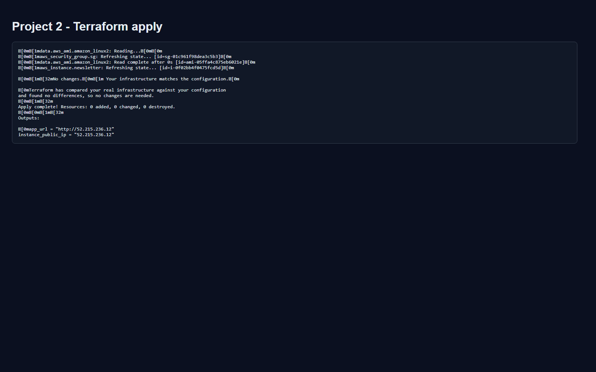
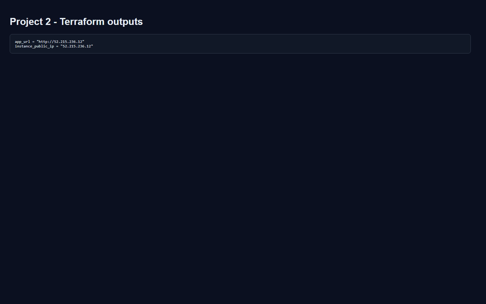
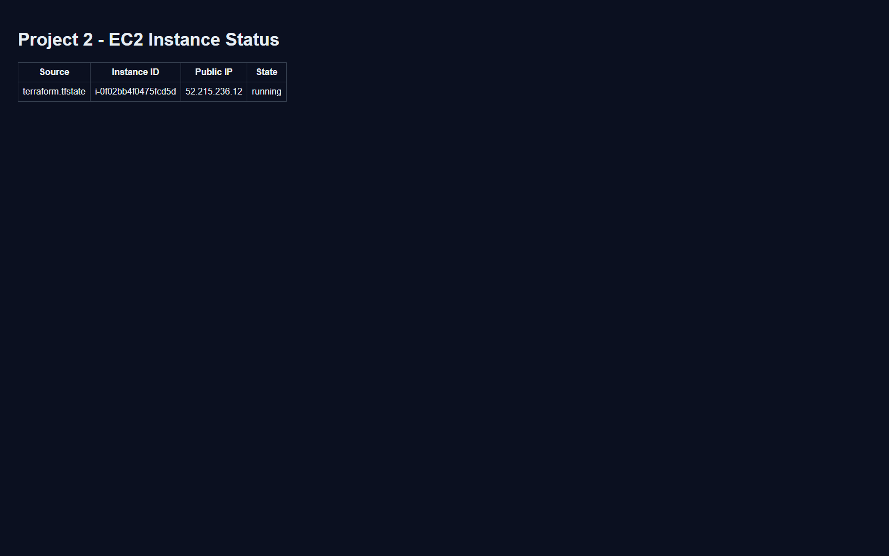
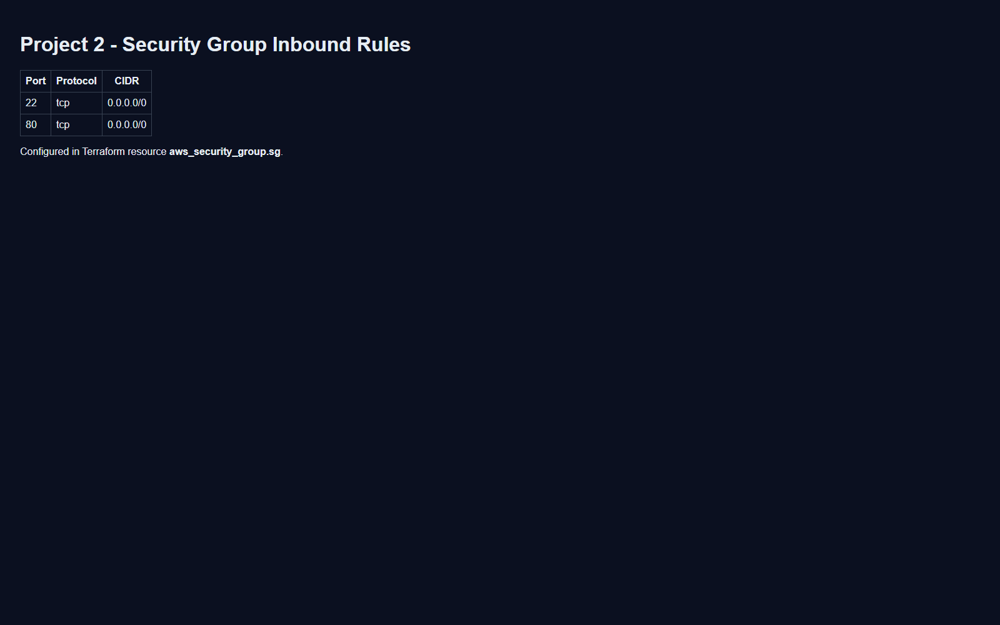
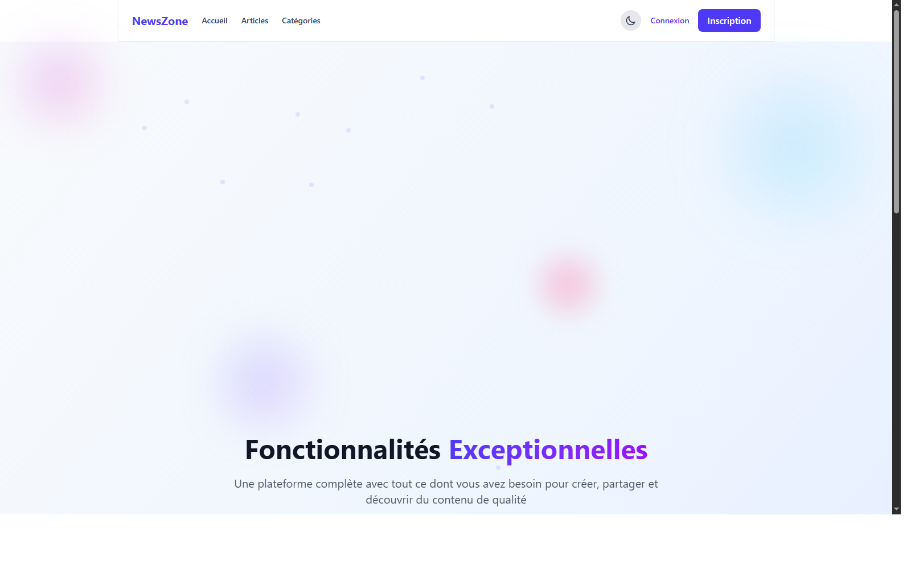

# Projet 2 : Newsletter App - Containerized & Deployed with Terraform

Objectif : déployer une application newsletter Docker sur EC2 avec Terraform (Security Group + User Data + Outputs).

Image applicative : construite depuis le repo News_Site via GitHub Actions, puis publiée sur Docker Hub.

- Repo app : https://github.com/yacineatmani/News_Site
- Image : `yacineatmani/newsletter-app:latest`

## Stack
- Terraform
- AWS EC2 (t3.micro)
- Docker
- Security Group (HTTP/SSH)

## Infrastructure
- `aws_security_group.sg` : autorise 80/tcp et 22/tcp
- `aws_instance.newsletter` : lance Docker et déploie l'image `yacineatmani/newsletter-app:latest`
- Outputs : IP publique et URL de l'application

## Déploiement
```bash
export AWS_PROFILE=terraform
terraform init
terraform validate
terraform plan
terraform apply -auto-approve
```

## Redéploiement avec image réelle
```bash
export AWS_PROFILE=terraform
terraform apply -replace=aws_instance.newsletter -auto-approve \
	-var="docker_image=yacineatmani/newsletter-app:latest" \
	-var="container_port=8000"
```

## Vérification
```bash
terraform output instance_public_ip
terraform output app_url
```

Ouvre ensuite l'URL dans le navigateur.

Si l'application ne répond plus mais que l'instance EC2 existe encore, recrée proprement l'instance :

```bash
terraform plan -replace=aws_instance.newsletter -out=tfplan-redeploy
terraform apply -auto-approve tfplan-redeploy
terraform output app_url
```

Note : l'IP publique peut changer après un redéploiement. Vérifie toujours la valeur retournée par `terraform output app_url`.

## Captures à ajouter
- Terraform apply
- Console EC2 (instance running)
- Application live dans le navigateur

## Fiche TL;DR (présentation demain)
- Voir le résumé prêt à l'oral : `FICHE_TLDR_PROJET_2.md`

## Captures écran (pack prêt)
- Guide rapide : `CAPTURES_PROJET_2.md`

Ajoute les images dans `screenshots/` avec ces noms :
- `01-terraform-apply.png`
- `02-terraform-output.png`
- `03-ec2-instance-running.png`
- `04-security-group-http-ssh.png`
- `05-app-live-browser.png`

Après ajout, tu peux les afficher dans le README avec :

```md





```

## Nettoyage (pour éviter les coûts)
```bash
terraform destroy -auto-approve
```
